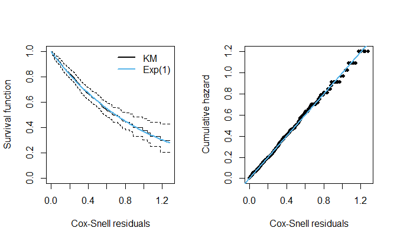

<!-- README.md is generated from README.Rmd. Please edit that file -->

# `cdnbcr`: Correlated Destructive Negative Binomial Cure Rate Model

<!-- badges: start -->

[](https://github.com/rdmatheus/cdnbcr/actions/workflows/R-CMD-check.yaml)
<!-- badges: end -->

The `cdnbcr` package provides tools for modeling time-to-event data in
the presence of a cure fraction, considering correlated competing risks.
The Correlated Destructive Negative Binomial Cure Rate (CDNBCR) model
describes the time until an event occurs while accounting for a cure
fraction, assuming multiple initial competing causes with potential
correlation. The model is destructive in the sense that some initial
competing causes contributing to the occurrence of the event can be
eliminated. Thus, the model is particularly useful in applications where
interventions (e.g., treatments) may eliminate or inactivate some
competing causes. Among the package’s contributions, we implemented an
Expectation-Maximization (EM) algorithm for maximum likelihood
estimation of the model parameters and we provide diagnostic plots based
on Cox-Snell residuals.

## Installation

You can install the current development version of `cdnbcr` from
[GitHub](https://github.com/rdmatheus/cdnbcr) with:

``` r
devtools::install_github("rdmatheus/cdnbcr")
```

To run the above command, it is necessary that the `devtools` package is
previously installed on R. If not, install it using the following
command:

``` r
install.packages("devtools")
```

After installing the devtools package, if you are using Windows, install
the most current
[RTools](https://cran.r-project.org/bin/windows/Rtools/) program.
Finally, run the command `devtools::install_github("rdmatheus/cdnbcr")`,
and then the package will be installed on your computer.

## Example

The `cdnbcr` package provides functions for estimation and inference for
the parameters as well as plot tools for assessing the goodness-of-fit
of the model. Below is an example of some functions usage and available
methods.

``` r
## Loading packages
library(cdnbcr)
library(survival)
```

### `e1690` dataset (see `?e1690`)

The `e1690` object contains observations of a well-known dataset from a
Phase III cutaneous melanoma clinical trial. The study was conducted by
the Eastern Cooperative Oncology Group (ECOG) and aimed to evaluate the
effectiveness of the Interferon alpha-2b chemotherapy in preventing
recurrence after surgery. The observations include 417 patients from
1991 to 1995, with follow-up until 1998.

#### Correlated destructive fit

The main function of the package is the `cdnbcr()` function, which
implements the EM algorithm for the estimation of the CDNBCR model
parameters.

``` r
## Correlated destructive fit
fit <- cdnbcr(formula = Surv(time, status) ~ nodeII + nodeIII + nodeIV - 1 |
                sex + trt + thickness + age, data = e1690)

class(fit)
#> [1] "cdnbcr"
```

It returns an object of the `"cdnbcr"` class, which has common usage
methods (e.g., `print`, `summary`, `plot`, among others). The methods
currently available for the `"cdnbcr"` class are presented below.

``` r
methods(class = "cdnbcr")
#>  [1] AIC          coef         logLik       model.frame  model.matrix
#>  [6] plot         predict      print        summary      vcov        
#> see '?methods' for accessing help and source code
```

``` r
## print
fit
#> Call:
#> cdnbcr(formula = Surv(time, status) ~ nodeII + nodeIII + nodeIV - 
#>     1 | sex + trt + thickness + age, data = e1690)
#> 
#> theta submodel with log link function:
#>   nodeII  nodeIII   nodeIV 
#> 1.100414 1.592870 2.418928 
#> 
#> p submodel with logit link function:
#>     (Intercept)       sexFemale trtChemotherapy       thickness             age 
#>      -0.8283426      -1.9336639       0.5597650       0.4299035       0.0533924 
#> 
#> Additional model parameter estimates:
#>        phi     alpha       mu    sigma
#>   2.598226 0.9781685 3.394487 2.287898
#> 
#> ---
#> Log-lik value: -502.7273 
#> AIC: 1029.455 and BIC: 1077.852 
#> EM iterations: 951

## summary
summary(fit)
#> Call:
#> cdnbcr(formula = Surv(time, status) ~ nodeII + nodeIII + nodeIV - 
#>     1 | sex + trt + thickness + age, data = e1690)
#> 
#> Summary for residuals:
#>        Mean Std. dev.  Skewness Kurtosis
#>   0.4429988 0.2731638 0.7159255 3.309368
#> 
#> theta submodel with log link function:
#>         Estimate Std. error t value Pr(>|t|)    
#> nodeII   1.10041    0.44635  2.4654 0.013687 *  
#> nodeIII  1.59287    0.54042  2.9475 0.003204 ** 
#> nodeIV   2.41893    0.51421  4.7042  2.5e-06 ***
#> ---
#> Signif. codes:  0 '***' 0.001 '**' 0.01 '*' 0.05 '.' 0.1 ' ' 1
#> 
#> p submodel with logit link function:
#>                  Estimate Std. error t value Pr(>|t|)
#> (Intercept)     -0.828343   1.679746 -0.4931   0.6219
#> sexFemale       -1.933664   1.299001 -1.4886   0.1366
#> trtChemotherapy  0.559765   0.788898  0.7096   0.4780
#> thickness        0.429904   0.363671  1.1821   0.2372
#> age              0.053392   0.033935  1.5734   0.1156
#> 
#> Additional model parameters:
#>                  phi     alpha        mu     sigma
#> Estimate   2.5982261 0.9781685 3.3944872 2.2878976
#> Std. error 0.7441392 0.0594861 0.3503527 0.2204368
#> 
#> ---
#> Log-lik value: -502.7273 
#> AIC: 1029.455 and BIC: 1077.852 
#> EM iterations: 951

## plot
par(mfrow = c(1, 2))
plot(fit, ask = FALSE)
```



``` r
par(mfrow = c(1, 1))
```

#### Uncorrelated destructive fit (alpha = 0)

The parameter $\alpha$ describes the dependence of the CDNBCR model. An
important special case occurs when $\alpha = 0$, i.e. an uncorrelated
destructive model. The uncorrelated model can be specified with the
`cdnbcr()` function with the argument `alpha = FALSE`, which sets the
parameter $\alpha = 0$ in the parameter estimation process.

``` r
fit0 <- cdnbcr(formula = Surv(time, status) ~ nodeII + nodeIII + nodeIV - 1 |
                 sex + trt + thickness + age, alpha = FALSE, data = e1690)

summary(fit0)
#> Call:
#> cdnbcr(formula = Surv(time, status) ~ nodeII + nodeIII + nodeIV - 
#>     1 | sex + trt + thickness + age, data = e1690, alpha = FALSE)
#> 
#> Summary for residuals:
#>        Mean Std. dev.  Skewness Kurtosis
#>   0.4413312 0.2732463 0.7080552 3.197274
#> 
#> theta submodel with log link function:
#>         Estimate Std. error t value Pr(>|t|)    
#> nodeII   0.98674    0.43676  2.2592 0.023869 *  
#> nodeIII  1.50469    0.54006  2.7861 0.005334 ** 
#> nodeIV   2.33377    0.54286  4.2990 1.72e-05 ***
#> ---
#> Signif. codes:  0 '***' 0.001 '**' 0.01 '*' 0.05 '.' 0.1 ' ' 1
#> 
#> p submodel with logit link function:
#>                  Estimate Std. error t value Pr(>|t|)
#> (Intercept)     -1.482456   1.389650 -1.0668   0.2861
#> sexFemale       -0.675326   0.856211 -0.7887   0.4303
#> trtChemotherapy -0.525835   1.004527 -0.5235   0.6007
#> thickness        0.187150   0.208348  0.8983   0.3690
#> age              0.045449   0.037213  1.2213   0.2220
#> 
#> Additional model parameters:
#>                 phi        mu     sigma
#> Estimate   2.565274 3.1279706 2.1749280
#> Std. error 1.008614 0.3881323 0.2319883
#> 
#> ---
#> Log-lik value: -505.0737 
#> AIC: 1032.147 and BIC: 1076.511 
#> EM iterations: 1090
```
